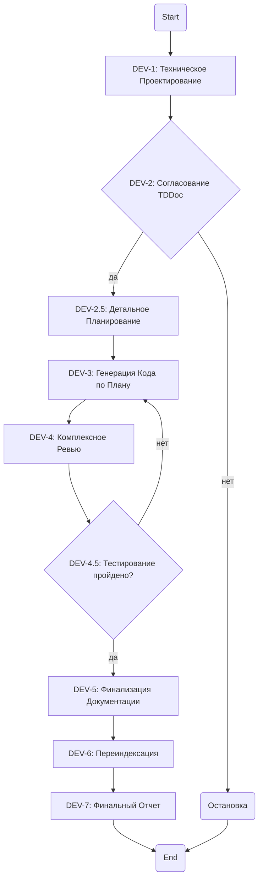

# Agentic Workflow: Feature Development Process

## Роль: Агент-Оркестратор

Ты получил `<SourceEpic>` и `<TaskFolder>`. Твоя задача — выполнить этот воркфлоу.

### ::ANCHOR-MAIN-WORKFLOW-DIAGRAM-01:: Основная Диаграмма Процесса

### Детализация Шагов

#### DEV-1: Техническое Проектирование

- **Задача**: Преобразовать `<SourceEpic>` в `Technical-Design.md`.
- **Действие**: Вызови `planner-agent`, передав ему `<SourceEpic>` и `<TaskFolder>`.
- **Результат**: Путь к `Technical-Design.md` внутри `<TaskFolder>`.

#### DEV-2: Согласование Технического Дизайна (Human-in-the-Loop)

- **Действие**: Остановись и запроси подтверждение у пользователя.

#### DEV-2.5: Детальное Планирование

- **Задача**: Декомпозировать `Technical-Design.md` на планы.
- **Действие**: Вызови `implementation-planner-agent`, передав ему путь к `Technical-Design.md` и `<TaskFolder>`.
- **Результат**: Пути к `Implementation-Plan.md` и `Testing-Plan.md`.

#### DEV-3: Итеративная Генерация Кода

- **Задача**: Написать код строго по `Implementation-Plan.md`.
- **Действие**: Для каждого пункта из плана вызывай релевантного агента-исполнителя, передавая ему пункт плана и `<TaskFolder>`.

#### DEV-4: Комплексное Ревью

- **Задача**: Проверить качество кода и соответствие TDDoc.
- **Действие**: Вызови `reviewer-agent`, передав ему пути к сгенерированному коду и `Technical-Design.md` из `<TaskFolder>`.

#### DEV-4.5: Quality Assurance (Тестирование)

- **Задача**: Проверить работоспособность кода.
- **Действие**: Вызови `tester-agent`, передав ему пути к коду и `Testing-Plan.md` из `<TaskFolder>`.
- **Логика**: Если тесты не пройдены, вернись на шаг `DEV-3` с отчетом от тестера для исправления.

#### DEV-5: Финализация Документации

- **Задача**: Обновить `.memory` на основе реализованных изменений.
- **Действие**: Вызови `docs-agent`, передав ему отчеты ревьюера/тестера и пути к измененным файлам.

#### DEV-6: Переиндексация Базы Знаний

- **Действие**: Запусти команду `/index`.

#### DEV-7: Финальный Отчет

- **Действие**: Сформируй финальный отчет в `<TaskFolder>` и сообщи пользователю о завершении.
