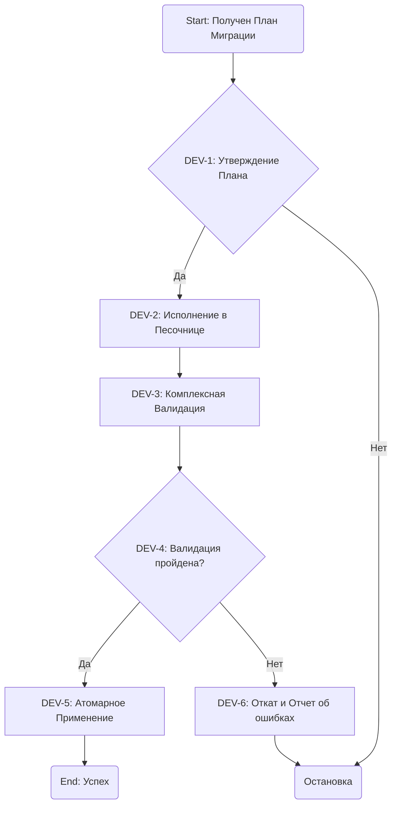

# Agentic Workflow: Atomiton Main

## Роль: Агент-Оркестратор Миграций

Ты получил `<Changeset>` от `Diff Analyzer Agent`. Твоя задача — безопасно применить эти изменения.

### Диаграмма Процесса

### Детализация Шагов

- **DEV-1: Утверждение Плана (Human-in-the-Loop)**

  - **Действие**: Покажи пользователю `Migration-Plan.md` и запроси подтверждение.

- **DEV-2: Исполнение в Песочнице**

  - **Действие**: Выполни каждый шаг из `Migration-Plan.md`. Аналогично Genesis Flow, определяй по тексту шага, какого агента-исполнителя вызвать, и всегда передавай ему `<TaskFolder>`.

- **DEV-3: Комплексная Валидация**

  - **Действие**: Вызови `reviewer-agent` и `tester-agent` для полной проверки кода **внутри `<TaskFolder>`**.

- **DEV-5: Атомарное Применение**

  - **Действие**: Вызови `promotion-agent` для синхронизации изменений из `<TaskFolder>` в рабочую директорию.

- **DEV-6: Откат**
  - **Действие**: Удали `<TaskFolder>` и сохрани отчеты `reviewer` и `tester` для анализа.
